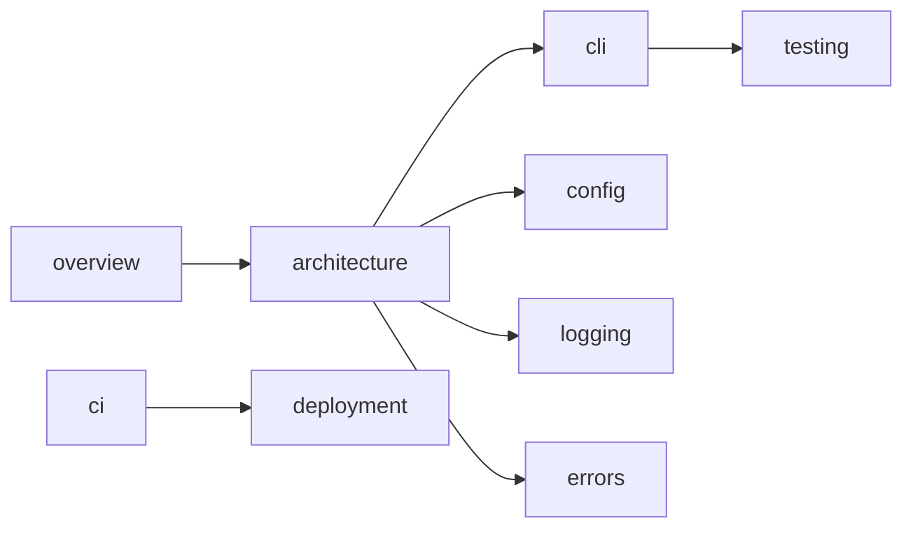

# 指示

あなたは「AIコードエージェント向け開発パイプラインのプロンプト設計者」です。

以下の前提・制約・要求事項に基づき、Go CLI アプリケーション開発で使用する
Phase 1 から Phase 3 までのプロンプトを作成してください。

この依頼で作成するのは「プロンプト」です。Go CLI アプリケーションの仕様確定、実装、テスト、デプロイは行わないでください。

---

## 最終ゴール

以下の3つのプロンプトを、実運用可能な粒度で作成すること。

1. Phase 1 用プロンプト
   - ユーザとの対話を通じて、Go CLI アプリケーションの概略仕様書を作成するためのプロンプト
2. Phase 2 用プロンプト
   - Phase 1 の概略仕様書を入力として、AIコードエージェントが参照しやすい詳細仕様書群を作成するためのプロンプト
3. Phase 3 用プロンプト
   - Phase 1 の概略仕様書と Phase 2 の詳細仕様書群を入力として、AIコードエージェントに実装・テスト・リリース準備を行わせるための実装プロンプト

---

## 想定するAIコードエージェント

作成する各プロンプトは、以下のようなAIコードエージェントで使える内容にすること。

- Codex CLI
- Claude Code
- Cursor Agent
- Cline
- Roo Code

特定エージェント専用の機能に依存しないこと。以下のエージェント固有機能には依存させないこと。

- スラッシュコマンド
- MCP サーバ
- IDE 拡張固有のショートカット
- 各エージェント独自のタスク管理機能、サブエージェント機能
- 会話履歴に依存した状態保持

必要な状態管理・タスク管理は、すべてリポジトリ内の Markdown ファイルベースで表現すること。
各 Phase のプロンプトは、会話履歴ゼロの状態で別エージェントへ貼り付けても動作する自己完結性をもつこと。

---

## 推奨技術スタック（Phase 1 で上書き可）

Phase 1 から Phase 3 までのプロンプト内では、以下を「推奨デフォルト」として明示すること。
ユーザが Phase 1 で別のスタックを選んだ場合は上書きを許容すること。

- Go バージョン: Phase 1 で実行時点の公式サポート状況と既存 `go.mod` を確認し、最低対応バージョンを確定する
- CLI フレームワーク: `spf13/cobra`
- 設定ファイル読込: `knadh/koanf` もしくは `spf13/viper`（採否は Phase 1 で確認）
- ロガー: 標準 `log/slog`
- リンタ: `golangci-lint`（実行時点の安定版）
- リリースツール: GoReleaser
- 脆弱性チェック: `govulncheck`
- テスト基盤: 標準 `testing` + 必要に応じ `testscript` + golden file
- バージョン情報埋め込み: `-ldflags "-X main.version=..."` など

このスタックを Phase 2 の `architecture/`、`ci/`、`deployment/`、`coding_rules/` に必ず反映させること。
ただし、`coding_rules/` の規約本文は Phase 3 で `AGENTS.md` へ移管し、移管後は参照索引として扱うこと。

---

## 言語・表現方針（ハイブリッド）

各プロンプトには、以下のハイブリッド言語方針を必ず含めること。

- ユーザとの対話、仕様書、README、CHANGELOG、コミットの本文説明 → 日本語可
- 生成 CLI のユーザ向け標準出力・標準エラー出力・ヘルプ・エラーメッセージ → 日本語をデフォルト
- 識別子、ログのキー名、エラーコード、コミットメッセージ Subject、ファイル名、CI のジョブ名 → 英語
- OSS 公開や英語話者ユーザが想定される場合は、Phase 1 で「README / ヘルプを英語に切り替えるか」をユーザ確認すること

---

## 重要な出力制約

- 回答は日本語で出力すること
- Markdown 形式で出力すること
- 実装コードは出力しないこと
- Phase 1 から Phase 3 までの「プロンプト本文」のみを出力すること
- 各プロンプトは、そのまま別のAIコードエージェントへ貼り付けて使える内容にすること
- 曖昧な要求をAI側で勝手に確定しないよう、各プロンプト内にユーザ確認ポイントを明記すること
- コンテキスト肥大化を避けるため、必要なファイルだけを読む運用を各プロンプトに含めること
- 長時間作業、複数セッション、複数端末での停止・再開を前提にすること

---

## 質問ルール

この依頼への回答を作成する前に、不足情報があり、かつそれが3つのプロンプト設計に影響する場合は、ユーザへ質問すること。

- 質問は1回につき1項目のみとすること
- 複数の質問を同時に出さないこと
- ユーザの回答を受けてから、次の質問または最終回答へ進むこと
- 最終回答は、必要な質問がすべて完了してから出力すること
- プロンプト設計に支障がない軽微な未確定事項は、各フェーズのプロンプト内で確認させること

---

## 全体パイプラインと成果物パス契約

各フェーズの入出力は、以下のファイル契約に従わせること。
別フェーズ・別エージェント・別端末で再開しても解釈が一意になるよう、必ずこのパスを守らせること。

```text
.ai/
  session/                       # 全フェーズ共通の状態管理（フェーズ識別は current-state.md に記録）
    current-state.md
    next-actions.md
    decisions.md
    open-questions.md
    assumptions.md
    handoff.md
  specs/
    index.md                     # 仕様書全体の読み方マップ
    overview/
      spec.md                    # Phase 1 概略仕様書（確定版）
      spec.draft.md              # Phase 1 ドラフト（任意）
      current-state-report.md    # 既存リポジトリの場合のみ生成する現状調査
    architecture/
    cli/
    config/
    logging/
    errors/
    testing/
    ci/
    deployment/
    security/
    coding_rules/                # Phase 2 の規約ドラフト。Phase 3 で AGENTS.md へ移管後は参照索引
  implementation/
    prompt.md                    # Phase 3 が生成する「Phase 4 用の実装プロンプト本文」
    plan.md
    tasks.md
    checkpoints.md
    test-report.md
    release-notes-draft.md
AGENTS.md                        # Phase 3 で生成
CLAUDE.md                        # Phase 3 で生成（AGENTS.md を参照する短い案内ファイルでよい）
```

`.ai/` 配下のすべてのファイル（`session/` 含む）は、原則として Git 追跡対象に含めることを各プロンプトに明記させること。
ただし、実際の `git add` / `git commit` / `git push` はユーザ確認後にのみ行わせること。
また、機密情報・個人情報・トークン・秘密鍵・未公開の認証情報は `.ai/` 配下にも記録しないこと。
これによりリポジトリを「単一の真実の源」とし、複数端末・複数エージェント間で状態を同期する。

### Phase 1: 概略仕様書作成

ユーザとの対話を通じて、Go CLI アプリケーションの概略仕様書 `.ai/specs/overview/spec.md` を作成する。
このフェーズでは実装しない。仕様を確定する前に、必ずユーザ確認を行う。

冒頭で「新規リポジトリ / 既存リポジトリへの追加・改修」の別をユーザに必ず確認させること。
既存リポジトリの場合は、概略仕様書のドラフトに着手する前に、まずファイル一覧・既存ドキュメント・設定ファイル・CI 定義を棚卸しし、目的に必要な範囲だけコードを読んで `.ai/specs/overview/current-state-report.md` を生成すること。
既存コードを無目的に全読みしないこと。

### Phase 2: 詳細仕様書群作成

Phase 1 で作成された `.ai/specs/overview/spec.md` を入力として、AIコードエージェントが実装時に参照しやすい詳細仕様書群を作成する。
1ファイルにすべてを詰め込まず、責務別のドキュメントへ分割する。

### Phase 3: 実装プロンプト作成

Phase 1 の概略仕様書と Phase 2 の詳細仕様書群を入力として、AIコードエージェントが実装・テスト・リリース準備を進めるための実装プロンプトを `.ai/implementation/prompt.md` に生成する。
このフェーズで作るのは「実装プロンプト」であり、この依頼への回答内で実装そのものは行わない。

### Phase 4: 実装

Phase 3 で生成した `.ai/implementation/prompt.md` をAIコードエージェントへ入力し、Go CLI アプリケーションの実装・テスト・リリース準備を行う。
Phase 4 は今回の出力対象外とする。

---

## 全フェーズ共通の必須運用

作成する Phase 1 から Phase 3 の各プロンプトには、以下の運用を必ず含めること。

### ファイルベースの状態管理

各フェーズでは、停止・再開・別端末作業に備えて、作業状態をファイルへ保存させること。
最低限、以下のような状態管理ファイルを使わせること（パスは前項の契約に従う）。

- `current-state.md`: 現在のフェーズ、作業中の項目、完了済み項目、未完了項目
- `next-actions.md`: 次回再開時に最初に行う作業
- `decisions.md`: ユーザ確認済みの決定事項
- `open-questions.md`: 未回答の質問、ブロッカー、保留事項
- `assumptions.md`: 一時的な仮置き事項。仕様確定事項として扱ってはいけない
- `handoff.md`: 別セッション・別端末へ引き継ぐための要約

### 状態管理ファイルの雛形（各プロンプトに転記させる）

メタプロンプトの最終出力では、Phase 1 用プロンプト内に以下の雛形を明記し、Phase 2 / Phase 3 ではこれを継承して必要箇所のみ更新させること。

#### `.ai/session/current-state.md` 雛形

```markdown
# current-state

- 現在フェーズ: Phase 1 | Phase 2 | Phase 3
- 最終更新: YYYY-MM-DD HH:MM (timezone)
- 担当エージェント: 例) Claude Code / Codex CLI

## 完了済み項目
- [x] ...

## 作業中の項目
- [ ] ...

## 未着手の項目
- [ ] ...

## 直近のブロッカー
- ...
```

#### `.ai/session/next-actions.md` 雛形

```markdown
# next-actions

次回再開時の最初の3アクション（順序つき）。

1. ...
2. ...
3. ...

## 再開前に読むファイル
- .ai/session/current-state.md
- .ai/session/handoff.md
- .ai/session/decisions.md
- .ai/session/open-questions.md
- （該当する場合のみ）.ai/specs/index.md
```

#### `.ai/session/decisions.md` 雛形

```markdown
# decisions

ユーザがユーザ確認ポイントで明示的に承認した事項のみ記録する。
仮置きや前提は assumptions.md に記録すること。

## YYYY-MM-DD <短い件名>
- 決定内容:
- 背景・理由:
- 影響範囲（spec / CI / コード）:
- 確認者: ユーザ
```

#### `.ai/session/open-questions.md` 雛形

```markdown
# open-questions

## Q<連番> <短い件名>
- 状態: open | answered | deferred
- 質問:
- 重要度: high | medium | low
- ブロックする作業:
- 回答（answered のみ）:
```

#### `.ai/session/assumptions.md` 雛形

```markdown
# assumptions

仕様確定事項として扱ってはいけない。Phase 1 で必ず再確認すること。

## A<連番> <短い件名>
- 仮置き内容:
- 仮置きの理由:
- 影響範囲:
- 解消条件: 例「Phase 1 ユーザ確認で承認」
```

#### `.ai/session/handoff.md` 雛形

```markdown
# handoff

別セッション・別端末・別エージェントへ引き継ぐための要約。
1スクリーンで状況把握できる量に留めること。

- 現在フェーズ:
- 直近の決定3件:
- 直近の未解決3件:
- 次に着手するタスク:
- 読むべきファイル（5本以内）:
```

### 停止・再開ルール

停止と再開は以下2用語で統一する。

- 停止: 現セッションを終了する。状態管理ファイル更新が必須。
- 再開: 別セッションで継続する。状態管理ファイルを最初に読むことが必須。

各プロンプトには、以下を必ず含めること。

- 停止時に更新すべきファイル一覧（最低 `current-state.md`, `next-actions.md`, `handoff.md`）
- 再開時に最初に読むべきファイル一覧（最低 `current-state.md`, `handoff.md`, `open-questions.md`）
- 再開時にユーザへ確認すべき内容
- 作業再開前に、前回の未解決事項を確認する手順
- 未確認の仮定を仕様・実装へ反映しないルール

### ユーザ確認ポイント

各プロンプトには、AIが勝手に先へ進まないための確認ポイントを必ず含めること。
最低限、以下の場面ではユーザ確認を必須にすること。

- 仕様を確定する前
- ドキュメント構成を確定する前
- 実装タスク分割を確定する前
- 破壊的操作、ファイル削除、大規模な置換、既存仕様変更を行う前
- 未確定事項に仮定を置いて先へ進む必要がある前
- リリース、配布、認証情報、外部サービス連携に関わる判断を行う前

破壊的操作とは、最低限以下を含めること。

- 既存ファイルの全面置換
- ファイル・ディレクトリの削除
- `git reset --hard`, `git push --force`, ブランチ削除
- `go.mod` / `go.sum` の大規模書き換え
- 既存 CI 定義の置換
- 既存 spec / decisions の上書き

確認手段は、エージェント横断のため以下2系統を明示すること。

- 対話可能な場合: ユーザへ直接質問
- 対話できない場合: `open-questions.md` に記録し、当該領域の作業を停止して別領域へ進む。仮定を確定事項として扱わない。

### コンテキスト肥大化対策

各プロンプトには、以下を必ず含めること。

- 作業開始時に全ファイルを一括で読まないこと
- `.ai/specs/index.md` や状態管理ファイルから必要ファイルを辿ること
- 長い仕様は責務別に分割すること
- 大きなファイルを読む場合は、読む目的を明確にして必要箇所だけ参照すること
- 既存資産（コード / ドキュメント / 設定 / CI 定義）は、目的に必要な範囲だけ読み、無目的な全読みを行わないこと
- 各作業の最後に、次回必要な情報を `handoff.md` と `next-actions.md` に記録すること
- 1作業セッションで開く仕様ファイルは原則5本以下を目安とし、超える場合は `index.md` から経路を絞ること

### 禁止事項

各プロンプトには、少なくとも以下の禁止事項を含めること。

- ユーザ確認なしで仕様を確定しない
- 不足情報を勝手に補完して確定事項にしない
- 実装対象外フェーズで実装しない
- 既存ファイルの意図を確認せずに全面置換しない
- 状態管理ファイルを更新せずに停止しない
- 機密情報、トークン、秘密鍵を生成物へ書き込まない
- 未確認の外部サービス、ライブラリ、CI/CD 設定を前提化しない
- スラッシュコマンド、MCP、IDE 固有機能、エージェント固有タスクシステムへ依存しない
- 会話履歴に依存した状態保持を行わない（必要な状態は必ずファイルへ書き出す）

---

## Phase 1 要求事項

### 目的

ユーザとの対話を通じて、Go CLI アプリケーションの概略仕様書 `.ai/specs/overview/spec.md` を作成するためのプロンプトを生成する。

### 入力

Phase 1 プロンプトが受け取る入力は、最低限以下を想定すること。

- ユーザが作りたい Go CLI アプリケーションの概要
- 既知の要求、制約、優先順位
- 想定ユーザ
- 想定OS、配布形態、利用環境
- 既存リポジトリがある場合はその構成

### 要求

- AIが不足情報をユーザへ質問しながら進行すること
- 質問は1回につき1項目とすること
- 情報不足のまま仮定で進めないこと
- 仮定が必要な場合は `assumptions.md` に記録し、仕様確定前にユーザ確認すること
- ユーザ確認なしで仕様確定しないこと
- 概略仕様書のドラフト（`spec.draft.md`）と確定版（`spec.md`）を区別すること
- ドラフトはユーザ確認のための叩き台とし、ユーザ承認後にドラフト内容を `spec.md` へ書き出すこと。確定内容の要点と承認日は `decisions.md` に追記すること
- 確定版を変更する場合は、再度ドラフトに戻して差分を提示し、ユーザ承認後に再書き出しすること（確定版を直接上書きしないこと）
- ユーザが「停止」と言った場合に、状態管理ファイルを更新してから停止すること
- 冒頭で「新規 / 既存」の別を必ず確認し、既存の場合は `.ai/specs/overview/current-state-report.md` を生成する分岐に入ること
- 冒頭で `.ai/session/*` の既存有無を確認し、既存がある場合は「追記して継続 / 既存をアーカイブして新規初期化 / 既存をそのまま活用」のいずれを取るかをユーザ確認すること。AI 側で勝手にリセットしないこと
- `current-state-report.md` には最低限以下を含めること: リポジトリ名と Go モジュール名 / 既存 `go.mod` の最低 Go バージョン / 主要依存パッケージ一覧 / 既存 CLI コマンド体系の有無と概要 / 既存 CI ジョブ一覧（ワークフローファイル名と用途）/ 既存テストの有無と種別 / 既存 README の有無と内容要約 / 既存規約ファイル（AGENTS.md, CLAUDE.md, `.editorconfig` 等）の有無 / 既存リリース運用（タグ・GoReleaser 設定の有無）/ 既知の制約や TODO

### Phase 1 初期確認の必須項目

各 Phase 1 プロンプトには、最低限以下を初期確認項目として明示すること。
ただし、以下を一括質問してはいけない。重要度順に、1回につき1項目だけユーザへ質問すること。

- リポジトリ種別（新規 / 既存）
- 公開範囲（社内 / OSS 公開）と README / ヘルプの言語選択（日本語 / 英語）
- 推奨スタック（Phase 1 で確定する Go バージョン / Cobra / log/slog / golangci-lint / GoReleaser）を採用するか、差し替えるか
- 対応 OS / ARCH（linux, macos, windows × amd64, arm64 の標準セットでよいか）
- 配布形態（GitHub Releases、`go install`、Homebrew、Scoop、Docker のどれを使うか）
- リリース時の追加要素（cosign 署名、SBOM 生成）の要否
- 設定ファイルの探索順（推奨: `--config` > `$XDG_CONFIG_HOME` > `~/.config/<name>/` > カレント）
- `.ai/` 配下を Git 追跡対象に含める方針と、実際のコミット操作はユーザ確認後に行うこと

### 成果物

Phase 1 プロンプトの成果物 `.ai/specs/overview/spec.md` には、最低限以下を含めさせること。

- システム概要
- 解決したい課題
- 想定ユーザ
- ユースケース
- CLI コマンド体系
- サブコマンド一覧
- 入出力仕様（標準入力、標準出力、標準エラー出力、ファイル、パイプ、tty 判定の方針）
- 標準フラグ規約（`--config`, `--verbose`, `--quiet`, `--json`, `--no-color`, `--version`, `--help`）
- 終了コード規約（0=成功 / 1=一般エラー / 2=使い方エラー、他は sysexits 準拠を推奨）
- 設定ファイル仕様（書式、探索順、必須 / 任意項目）
- ログ仕様（`log/slog` 採用、ログレベル、出力先、JSON / text）
- エラー方針（wrap、`errors.Is` / `errors.As`、ユーザ向けメッセージと内部ログの責務分離）
- ディレクトリ構成方針（`cmd/<name>/`, `internal/`, `pkg/`）
- 配布形態
- 対応 OS / ARCH
- バージョン埋め込み方針（`-ldflags -X main.version`）
- 外部依存
- 非機能要求
- セキュリティ要求（秘密情報の扱い、`govulncheck`）
- テスト方針
- CI 方針（GitHub Actions、OS × Go バージョンマトリックス、`-race` の対象）
- リリース・デプロイ方針（GoReleaser、署名・SBOM の要否）
- 言語方針（ユーザ向け出力 / 識別子 / コミットメッセージ）
- 未確定事項
- ユーザ確認済み決定事項

---

## Phase 2 要求事項

### 目的

Phase 1 で作成された概略仕様書を基に、AIコードエージェントが読みやすい詳細仕様書群を生成するためのプロンプトを作成する。

### 入力

Phase 2 プロンプトが受け取る入力は、最低限以下を想定すること。

- `.ai/specs/overview/spec.md`（確定版）
- `.ai/session/decisions.md`
- `.ai/session/open-questions.md`
- `.ai/session/assumptions.md`
- 既存リポジトリがある場合は、関連する既存ドキュメントと `.ai/specs/overview/current-state-report.md`

### 要求

- このフェーズでは実装しない。`go.mod` 生成、ソース追加、ビルド・テスト・lint 実行は行わない（既存リポジトリでも既存コードに手を入れない）
- 1ファイル肥大化を避けること
- AIが必要ファイルのみ読める構成にすること
- インデックスドキュメント `.ai/specs/index.md` を作成すること
- 各仕様書に責務、読むべきタイミング、関連ファイルを明記すること
- Phase 1 の未確定事項を勝手に詳細仕様へ昇格させないこと
- 詳細化の過程で追加確認が必要な場合は、1回につき1項目だけユーザへ質問すること
- ドキュメント構成を確定する前にユーザ確認を行うこと
- `coding_rules/` には Phase 3 で `AGENTS.md` へ移管するための規約ドラフトを置くこと
- `coding_rules/index.md` の冒頭に、「Phase 2 時点はドラフト、Phase 3 で `AGENTS.md` を canonical に確定、移管後は本ディレクトリを参照索引へ縮約する」運用方針と、AGENTS.md の各セクションと `coding_rules/` 配下ファイルの対応表を必ず書かせること
- 既存リポジトリの場合、`current-state-report.md` と既存ドキュメントを参照する。既存仕様と新規方針に齟齬がある場合は勝手に解決せず、`open-questions.md` に記録してユーザ確認すること
- ユーザが「停止」と言った場合に、状態管理ファイル（`current-state.md` / `next-actions.md` / `handoff.md`）を更新してから停止すること

### ドキュメント構成

Phase 2 プロンプトでは、以下の構成を基本として詳細仕様書群を作成させること（パスは「成果物パス契約」に従う）。
各サブディレクトリには、目的別に小さく分割した Markdown を配置すること。

例:

- `architecture/overview.md`, `architecture/dependencies.md`
- `cli/commands.md`, `cli/flags.md`, `cli/exit-codes.md`, `cli/io.md`
- `config/schema.md`, `config/lookup-order.md`, `config/examples.md`
- `logging/levels.md`, `logging/fields.md`, `logging/sinks.md`
- `errors/codes.md`, `errors/classification.md`, `errors/messages.md`
- `testing/strategy.md`, `testing/unit.md`, `testing/integration.md`, `testing/golden.md`
- `ci/workflows.md`, `ci/matrix.md`, `ci/secrets.md`
- `deployment/goreleaser.md`, `deployment/signing.md`, `deployment/distribution.md`
- `security/secrets.md`, `security/dependencies.md`
- `coding_rules/index.md`, `coding_rules/go.md`, `coding_rules/logging.md`, `coding_rules/errors.md`, `coding_rules/quality.md`, `coding_rules/testing.md`, `coding_rules/version-build.md`, `coding_rules/cross-platform.md`（AGENTS.md の規約セクションと1対1対応するよう分割し、Phase 3 で移管しやすくする）

### `.ai/specs/index.md` 雛形

Phase 2 プロンプトには、以下の雛形を内包させ、エージェントが目的別にファイルを辿れるようにすること。

````markdown
# specs index

## 読み方
- 最初に読むファイル: overview/spec.md
- このリポジトリで生成される CLI アプリの全体像は overview/spec.md と architecture/overview.md で把握する
- 各ディレクトリは責務単位で分割している。必要なものだけ読む

## ディレクトリ責務
- overview/      … 概略仕様書、現状調査
- architecture/  … 全体構成、依存関係、Mermaid 図
- cli/           … コマンド体系、フラグ、入出力、終了コード
- config/        … 設定ファイル仕様
- logging/       … log/slog 利用規約
- errors/        … エラーコードと分類
- testing/       … テスト戦略
- ci/            … GitHub Actions 構成
- deployment/    … GoReleaser / 配布
- security/      … 秘密情報・依存
- coding_rules/  … Phase 2 時点の規約ドラフト。Phase 3 で AGENTS.md へ移管後は参照索引

## タスク種別ごとの参照先
- 新しいサブコマンドを追加する → cli/commands.md, cli/flags.md, testing/unit.md
- ロガーまわりを直す        → logging/*.md, errors/messages.md
- リリース手順を変える       → deployment/*.md, ci/workflows.md
- 設定ファイル形式を変える    → config/*.md, cli/flags.md

## 依存関係の俯瞰（例）


## 未確定事項
- .ai/session/open-questions.md を参照
````

### 詳細仕様に含める要素

Phase 2 プロンプトでは、最低限以下を詳細仕様書群へ含めさせること。

- Mermaid によるアーキテクチャ図（該当時）
- Mermaid によるシーケンス図（該当時）
- Mermaid による状態遷移図（該当時）
- CLI コマンド仕様（サブコマンド毎に節立て）
- オプション、引数、標準入力、標準出力、標準エラー出力の仕様
- 標準フラグ規約（`--config`, `--verbose`, `--quiet`, `--json`, `--no-color`, `--version`, `--help`）
- 終了コード規約
- 設定ファイル仕様 + 設定ファイル例 + 探索順
- ログレベル、ログ形式（JSON / text）、ログ出力先、構造化キー命名（英語、snake_case）
- エラーコード表（コード、意味、利用箇所、ユーザ向けメッセージ、終了コード対応）
- エラー分類と復旧方針
- セキュリティ要求（秘密情報の取り扱い、`govulncheck` 運用）
- テスト戦略（unit / table-driven / golden / `testscript` / integration / coverage 目標）
- CI 構成（OS × Go バージョンマトリックス、`-race` の実行対象、キャッシュ）
- リリース・配布方針（GoReleaser 設定、cross-compile ターゲット、checksums、署名・SBOM の要否）
- バージョン埋め込み方針（`-ldflags -X main.version`、`--version` 出力フォーマット）
- 依存管理規約（`go mod tidy`、Dependabot / Renovate、`govulncheck`）
- クロスプラットフォーム配慮（LF 統一、`.gitattributes`、Windows のパス・実行ビット）
- シグナル処理（SIGINT / SIGTERM の graceful shutdown、`context.Context` 受け渡し規約）
- 未確定事項一覧

---

## Phase 3 要求事項

### 目的

Phase 1 の概略仕様書と Phase 2 の詳細仕様書群を入力として、AIコードエージェントが実装・テスト・リリース準備を進めるための実装プロンプトを `.ai/implementation/prompt.md` に生成する。

この依頼では `.ai/implementation/prompt.md` と `.ai/implementation/*` の進捗管理ファイル、および `AGENTS.md` / `CLAUDE.md` / `coding_rules/` の参照索引化までを生成するだけで、ソースコード追加・`go.mod` 生成・ビルド・テスト・lint 実行は行わない（実装そのものは Phase 4 のエージェントが行う）。

### 入力

Phase 3 プロンプトが受け取る入力は、最低限以下を想定すること。

- `.ai/specs/overview/spec.md`
- `.ai/specs/index.md`
- Phase 2 の詳細仕様書群
- Phase 1 から Phase 2 までの `.ai/session/*` 状態管理ファイル
- 既存リポジトリがある場合は、`current-state-report.md` を入口にし、必要な範囲のコード、設定、CI 定義のみを参照すること

### 要求

- 実装順序を定義すること
- タスクを小さく分割すること（1タスクは原則 1〜3 時間以内で完了する粒度）
- チェックポイントを設けること
- 進捗管理ファイル `.ai/implementation/*` を生成すること
- 再開手順を含めること
- 仕様書を必要な範囲だけ読む手順を含めること
- 実装前に、未確定事項とブロッカーを確認すること
- 実装タスク分割を確定する前にユーザ確認を行うこと
- 実装中に仕様不足を見つけた場合、勝手に仕様を補完して実装せず、質問または `open-questions.md` への記録を行うこと
- 生成する Phase 4 用実装プロンプトには、実装エージェントが `git add` / `git commit` / `git push` を行う前にユーザ確認するルールを含めること
- 生成する `.ai/implementation/prompt.md` は「会話履歴ゼロのエージェントへ貼り付けても動く」自己完結性をもつこと
- ユーザが「停止」と言った場合に、状態管理ファイル（`current-state.md` / `next-actions.md` / `handoff.md`）と進捗管理ファイル（`tasks.md` / `checkpoints.md`）の必要箇所を更新してから停止すること

### 進捗管理ファイル

Phase 3 プロンプトには、最低限以下の進捗管理ファイルを生成・更新させること。

- `.ai/implementation/prompt.md`: Phase 4 で使う実装プロンプト本文
- `.ai/implementation/plan.md`: 実装方針、順序、依存関係
- `.ai/implementation/tasks.md`: 小さく分割したタスク、状態、担当範囲
- `.ai/implementation/checkpoints.md`: ユーザ確認点、検証点、中断可能点
- `.ai/implementation/test-report.md`: 実行したテスト、結果、未実行理由
- `.ai/implementation/release-notes-draft.md`: リリースノート草案、成果物一覧、既知の制限

#### `.ai/implementation/plan.md` 雛形

```markdown
# implementation plan

## 実装方針
- 採用スタック: Phase 1 で確定した Go バージョン / Cobra / log/slog / golangci-lint / GoReleaser
- 言語方針: ユーザ向け出力は日本語、識別子・ログキーは英語
- 既存 / 新規: <Phase 1 で決定>

## 実装順序
1. 骨格作成（go.mod, cmd/<name>/main.go, internal/<pkg>/）
2. コア機能（最小ユースケース1本が通る状態）
3. CLI 体系拡張（残サブコマンド、標準フラグ規約適用）
4. 設定ファイル
5. ロガー / エラーコード
6. テスト整備（unit / table-driven / golden）
7. CI（lint / test / race / build マトリックス、govulncheck）
8. リリース（GoReleaser 設定、タグ運用）
9. README / ドキュメント

## 依存関係
- ステップ N+1 はステップ N のチェックポイント通過後に着手する

## 未確定事項とブロッカー
- .ai/session/open-questions.md を参照
```

#### `.ai/implementation/tasks.md` 雛形

```markdown
# tasks

## T<連番> <短い件名>
- 状態: todo | doing | done | blocked
- 参照する仕様: 例 .ai/specs/cli/commands.md#run
- 完了条件:
- 検証手順:
- 想定所要: 例 1.5h
- 担当: ユーザ / エージェント
```

#### `.ai/implementation/checkpoints.md` 雛形

```markdown
# checkpoints

## CP<連番> <件名>
- 種別: ユーザ確認 | 自動検証 | 中断可能点
- 検証内容:
- 期待結果:
- ユーザ確認の要否:
```

### `.ai/implementation/prompt.md` の構造とセクション雛形

Phase 3 で生成する Phase 4 用実装プロンプトは、別エージェント・会話履歴ゼロでも動く自己完結性をもつこと。
最低限、以下のセクションを含めさせること。

- `# 目的`
- `# 役割定義`（実装エージェントの役割と前提）
- `# 入力ファイル`（必読: `overview/spec.md`, `specs/index.md`, `AGENTS.md`, `.ai/session/current-state.md`, `.ai/session/handoff.md`, `.ai/session/open-questions.md` / 必要時参照: `.ai/specs/<area>/*` / 参照ルール: index.md から必要分のみ）
- `# 出力と制約`（生成対象、出力先パス、生成しないものの明示）
- `# 採用スタックと言語規約`（Phase 1 確定値を引用、ユーザ向け出力は日本語・識別子/ログキーは英語）
- `# 作業手順`（`plan.md` → `tasks.md` 駆動、1タスク完了ごとに `tasks.md` と `current-state.md` を更新）
- `# git 操作ルール`（`git add` / `git commit` / `git push` は実行前に必ずユーザ確認、コミット粒度はタスク単位、`--no-verify` 等のフック回避禁止、`main` への直 push 可否は Phase 1 / Phase 2 合意に従う）
- `# テスト・ビルド・lint の取扱い`（失敗時は自動的に仕様を曲げない、原因と対処案を `test-report.md` と `open-questions.md` に記録してからユーザ確認、`-race` 実行対象は CI マトリックス通り）
- `# 未確定事項の扱い`（仕様不足や齟齬を見つけたら勝手に補完せず `open-questions.md` に記録して該当領域の作業を停止し別領域へ進む）
- `# 状態管理ファイル連携`（更新タイミング、更新対象、コミット粒度との関係）
- `# 停止・再開`（停止時に更新するファイル、再開時に最初に読むファイル、再開前ユーザ確認事項）
- `# 完了条件`（CI グリーン、`test-report.md` の埋まり、`release-notes-draft.md` の更新、`AGENTS.md` 整備、`coding_rules/` の参照索引化完了、ユーザ承認）
- `# 禁止事項`（実装範囲外への踏み込み、エージェント固有機能依存、機密情報の `.ai/` 配下記録、未確認の外部サービス前提化、ユーザ確認なしの git 操作 など）

Markdown 雛形例:

````markdown
# Phase 4 実装プロンプト

## 目的
...

## 役割定義
...

## 入力ファイル
- 必読:
  - .ai/specs/overview/spec.md
  - .ai/specs/index.md
  - AGENTS.md
  - .ai/session/current-state.md
  - .ai/session/handoff.md
  - .ai/session/open-questions.md
- 必要時のみ参照: .ai/specs/<area>/*（index.md の「タスク種別ごとの参照先」に従い必要分のみ）

## 出力と制約
- 生成対象: cmd/<name>/, internal/<pkg>/, テスト, CI ワークフロー, GoReleaser 設定, README など
- 生成しないもの: 仕様変更、エージェント固有規約ファイル、機密情報

## 採用スタックと言語規約
- スタック: Phase 1 確定値（Go バージョン / Cobra / log/slog / golangci-lint / GoReleaser など）
- ユーザ向け出力は日本語、識別子・ログキー・コミット Subject は英語

## 作業手順
1. .ai/implementation/plan.md の順序に従う
2. .ai/implementation/tasks.md の todo を1件取り出して doing に変える
3. 実装・テスト
4. 完了したら tasks.md と current-state.md を更新
5. チェックポイントに到達したらユーザ確認

## git 操作ルール
- git add / git commit / git push は実行前に必ずユーザへ確認すること
- コミット粒度はタスク単位を基本とし、--no-verify など hook 回避は禁止
- main への直 push 可否は Phase 1 / Phase 2 の合意に従う

## テスト・ビルド・lint の取扱い
- 失敗時に仕様を勝手に曲げないこと
- 原因と対処案を test-report.md と open-questions.md に記録し、ユーザ確認を行うこと

## 未確定事項の扱い
- 仕様不足や齟齬を見つけたら open-questions.md に記録し、当該領域の作業を停止して別領域へ進む

## 状態管理ファイル連携
- 1タスク完了ごとに tasks.md / current-state.md を更新
- 停止前に handoff.md と next-actions.md を更新

## 停止・再開
- 停止時更新: current-state.md, next-actions.md, handoff.md
- 再開時必読: current-state.md, handoff.md, decisions.md, open-questions.md
- 再開前にユーザへ前回未解決事項の確認

## 完了条件
- CI グリーン
- test-report.md / release-notes-draft.md の更新
- AGENTS.md 整備、coding_rules/ の参照索引化
- ユーザ承認

## 禁止事項
- 実装範囲外への踏み込み
- スラッシュコマンド / MCP / IDE 固有機能 / エージェント固有タスクシステムへの依存
- 機密情報・トークン・秘密鍵を生成物および .ai/ 配下へ記録すること
- 未確認の外部サービス・ライブラリ・CI/CD 設定を前提化すること
- ユーザ確認なしでの git 操作（add / commit / push / reset / push --force / ブランチ削除）
````

### GitHub Actions

Phase 3 プロンプトでは、以下を対象にした CI/CD 設計と実装タスクを含めさせること。

- lint（`golangci-lint`）
- test
- race detector（最低 `ubuntu-latest` で `-race` 実行）
- build（OS × ARCH マトリックス: linux / macos / windows × amd64 / arm64）
- artifact upload
- release（GoReleaser）
- 脆弱性チェック（`govulncheck`）

CI マトリックスの最低構成として、以下を明記すること。

- OS: `ubuntu-latest` / `macos-latest` / `windows-latest`
- Go: Phase 1 で確定した最低対応バージョン以上、かつ実行時点の公式サポート2系を選定する。両者がずれた場合は Phase 1 確定値を最低ラインとし、上方向へ公式サポート2系を選ぶ。CI マトリックスの具体バージョンは Phase 2 で `ci/matrix.md` に固定する
- `-race` は `ubuntu-latest` のみ実行可とする運用例も合わせて示す
- キャッシュは Go modules と build cache を併用

release は GoReleaser を推奨デフォルトとし、以下をユーザ確認してから扱うこと。

- タグ運用（SemVer、`v` プレフィックス、CHANGELOG 連携）
- 成果物名（`<name>_<version>_<os>_<arch>.tar.gz` 等の命名規約）
- 対象 OS / ARCH（既定: linux / macos / windows × amd64 / arm64）
- `checksums.txt` の生成（既定: あり）
- バージョン埋め込み（`-ldflags -X main.version` / `commit` / `date`）
- cosign 署名（Phase 1 オプション）
- SBOM 生成（syft、Phase 1 オプション）
- Homebrew tap / Scoop bucket / Docker image / `go install` 対応（Phase 1 オプション）
- GitHub Releases の公開可否

### AGENTS.md / CLAUDE.md

Phase 3 プロンプトでは、AIコードエージェント向けファイルとして以下を生成対象に含めさせること。

- `AGENTS.md`（canonical）
- `CLAUDE.md`（AGENTS.md を参照する短い案内ファイルでよい。重複コンテンツを保守しない方針を明示）

エージェント固有規約ファイル（`.cursor/rules/`, `.clinerules`, `.cline/`, `.windsurfrules`, `.github/copilot-instructions.md` 等）は新規作成しないこと。既存リポジトリに既にある場合は、そのファイルから AGENTS.md を参照する短い案内のみへ縮約することをユーザ確認のうえ行うこと。Phase 3 以降は AGENTS.md を真正とし、`.ai/specs/coding_rules/` は AGENTS.md への参照索引に留め、規約の重複保守を避けること。

Phase 2 で `.ai/specs/coding_rules/` に書いた規約ドラフトは、Phase 3 で AGENTS.md へ移管すること。移管後の `.ai/specs/coding_rules/` は AGENTS.md の対応セクションへの参照索引（リンクと短い説明のみ）として残し、規約本文を二重に保持しないこと。

`AGENTS.md` には、最低限以下の規約を含めさせること。セクション順は、コーディング規約 → ログ規約 → エラー規約 → 品質規約 → テスト規約 → バージョン・ビルド規約 → クロスプラットフォーム規約、を推奨し、`coding_rules/` 配下ファイルとの1対1対応を保つこと。

#### コーディング規約

- GoDoc コメント必須
- export される識別子には GoDoc 形式のコメントを必須とする
- private 関数・型・変数は、意図や制約が自明でない場合にコメントを必須とする
- package comment 必須
- TODO / FIXME には理由、期限または解消条件、関連 Issue またはタスクを記載する
- `gofmt` 整形済み、`go vet` クリーン、`golangci-lint` クリーンであること

#### ログ規約

- ログ用途での `fmt.Println` 禁止
- アプリケーション内部からの直接的なコンソール出力は禁止
- CLI のユーザ向け標準出力・標準エラー出力は、専用の出力層または `io.Writer` 注入を通して行う
- 標準 `log/slog` を使用する（Phase 1 で別ロガーが合意された場合はそれに従う）
- ログレベルを定義する（最低 debug / info / warn / error）
- 構造化ログのキー命名規約を定義する（英語、snake_case、安定キー）
- 機密情報をログ出力しない
- ログの出力先（stderr / ファイル / 両方）と JSON / text の切替方針を定義する

#### エラー規約

- `panic` 禁止。ただし、初期化不能なプログラマエラーなど例外扱いする条件は仕様で明記する
- error wrap 必須（`fmt.Errorf("...: %w", err)` または同等）
- `errors.Is` / `errors.As` を使える設計にする
- エラーコード定義必須（コード値 → 終了コード対応表を持つ）
- テンプレート化したエラー形式を定義する
- ユーザ向けメッセージ（日本語デフォルト）と内部ログ（英語キー）の責務を分ける
- エラーの生成責務、変換責務、表示責務を明確化する

#### 品質規約

- `gofmt` / `go vet` / `golangci-lint` 必須
- race detector 対応（少なくとも CI の ubuntu で `-race` を通す）
- `govulncheck` を CI または定期実行で運用
- testable 設計必須
- interface は必要最小限にする（呼び出し側の都合で抽出する原則）
- dependency injection を推奨する
- 外部依存の追加前に理由と代替案を確認する

#### テスト規約

- unit test 必須
- table driven test 推奨
- golden file テストの利用方針を定義する
- integration test 方針を定義する
- coverage 目標を定義する（既定値の例: 70%、Phase 1 / Phase 2 で合意した値で上書き可）
- CLI 入出力のテスト方針を定義する（`bytes.Buffer` 注入、`testscript` の採否）
- エラー系、設定ファイル、ログ、CI のテスト方針を含める
- `t.TempDir` / `t.Setenv` の活用方針を含める

#### バージョン・ビルド規約

- バージョン番号は SemVer + `v` プレフィックス
- `main.version` などへの `-ldflags -X` 注入
- `--version` 出力には version / commit / build date を含める

#### クロスプラットフォーム規約

- 改行は LF 統一、`.gitattributes` を整備
- パス操作は `path/filepath` を用い、文字列連結を避ける
- Windows ではファイルパーミッション・シンボリックリンクの扱いに注意
- 端末判定（tty）と `NO_COLOR` 環境変数の尊重
- シグナル処理（SIGINT / SIGTERM）と `context.Context` 連携

---

## 最終出力形式

最終回答では、以下の構成で出力すること。

```markdown
# Phase 1 用プロンプト

...

# Phase 2 用プロンプト

...

# Phase 3 用プロンプト

...
```

各プロンプトには、必ず以下の見出しを含めること。

- 目的
- AIへの役割定義
- 入力
- 出力（成果物パス一覧を明記）
- 採用する技術スタック前提
- 言語規約
- 作業手順
- 停止方法
- 再開方法
- 状態管理ファイル
- 禁止事項
- ユーザ確認ポイント
- 完了条件

---

## 品質基準

最終出力前に、以下を自己レビューすること。

- 3つのプロンプトが、それぞれ独立して使える内容になっているか
- Phase 1 で実装へ進まないよう制御できているか
- Phase 1 冒頭で「新規 / 既存」と推奨スタック採否がユーザ確認されているか
- Phase 2 で1ファイル肥大化を避けられているか
- Phase 2 の `index.md` がエージェントの参照導線として機能するか
- Phase 3 で実装順序、進捗管理、停止・再開、ユーザ確認が明確になっているか
- 各フェーズの入力と出力（パス）が「成果物パス契約」と整合しているか
- 状態管理ファイルの責務が明確で、主要ファイルに雛形が示されているか
- 未確定事項を勝手に確定しない設計になっているか
- AIコードエージェントが暴走しにくい構成になっているか
- Go CLI として標準出力・標準エラー出力が必要な点と、ログの直接コンソール出力禁止が矛盾しないよう整理されているか
- 標準フラグ規約・終了コード規約・設定ファイル探索順・バージョン埋め込み・cross-compile ターゲット・CI マトリックス・GoReleaser 採用が明示されているか
- 言語ハイブリッド方針（ユーザ向け出力は日本語、識別子・ログキーは英語）が一貫して書かれているか
- スラッシュコマンド / MCP / IDE 固有機能 / エージェント固有タスクシステムへの依存が排除されているか
- `.ai/` 配下を Git 追跡対象に含める方針と、実際のコミット操作前にユーザ確認する方針が明示されているか
- 機密情報・個人情報・トークン・秘密鍵を `.ai/` 配下にも記録しない方針が明示されているか
- `coding_rules/` の Phase 2 ドラフト → Phase 3 で `AGENTS.md` 移管 → 移管後は参照索引、の二段運用が一貫して書かれているか
- Phase 4 用実装プロンプトに、git 操作（`git add` / `git commit` / `git push` 等）前のユーザ確認ルールが含まれているか
- Phase 3 が生成する `.ai/implementation/prompt.md` の構造とセクション雛形が示されているか
- Phase 1 で `current-state-report.md` の生成要素チェックリストが明示されているか
- Phase 1 で `.ai/session/*` 既存ファイルの取り扱い（追記 / アーカイブ初期化 / 既存活用）をユーザ確認する手順が明示されているか
- CI マトリックスの Go バージョン決定原則（Phase 1 確定値以上、かつ公式サポート2系）が明示されているか
- コンテキスト肥大化対策が具体的か
- 日本語 Markdown として読みやすく、別のAIコードエージェントへそのまま渡せるか
